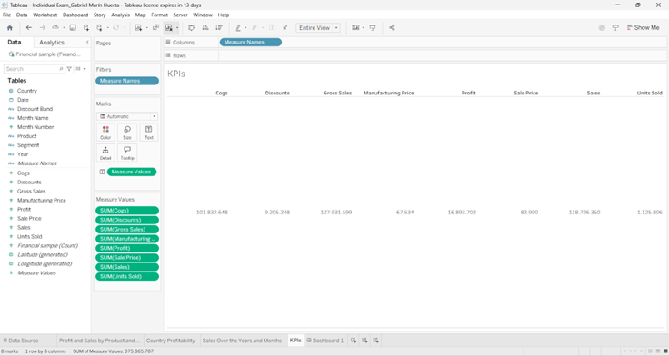

# 📊 Financial Performance Dashboard (Tableau)
### Capstone Project: Business Intelligence & Analytics

**Program:** Disruptive Technologies & Modern Management
**Course:** Business Intelligence & Analytics
**Institution:** KEDGE Business School (Paris, France)
**Author:** Gabriel Marín Huerta
**Date:** July 2025

---

## 📑 Executive Summary
This project represents the **Final Exam** for the Data Analytics course at KEDGE Business School. The objective was to analyze a financial dataset to uncover profitability trends, sales performance by segment, and geographic distribution.

Using **Tableau**, I developed an interactive dashboard that allows stakeholders to visualize Key Performance Indicators (KPIs) across different markets and time periods.

### Key Performance Indicators (KPIs)
A snapshot of the primary metrics tracked in this analysis:

---

## 1. 🎯 Business Task (The Challenge)
The exam required a comprehensive analysis of the "Financial Sample" dataset to answer critical business questions:
1.  **Profitability:** Which countries and segments are generating the most profit?
2.  **Product Performance:** How do Sales and Profit compare across different products?
3.  **Trends:** What is the evolution of Sales over time (Yearly and Monthly)?

---

## 2. 🛠️ Analysis & Visualizations
*The following visualizations were created in Tableau as part of the practical examination.*

### 🌍 1. Global Profitability Analysis
**Task:** Analyze profitability by Country using a map visualization.
* **Insight:** The map highlights key performing regions, allowing for quick identification of high-margin markets vs. loss-making territories.

### 📈 2. Sales Evolution (Time Series)
**Task:** Show the evolution of Sales over time.
* **Approach:** I utilized a combination of line and bar charts to demonstrate both the yearly growth trajectory and seasonal monthly fluctuations.

### 📊 3. Product & Segment Performance
**Task:** Visualize the sum of Profit and Sales by Product and Segment.
* **Insight:** This comparison reveals which product lines drive the most revenue versus which ones are actually profitable after costs.

---

## 3. 🚀 Key Visualization & Final Dashboard
The final deliverable consolidates the most critical insights into a comprehensive view for executive reporting.

---

## 📂 Project Files
* [📥 **Download Tableau Workbook (.twb)**](Individual%20Exam_Gabriel%20Marín%20Huerta.twb) - Requires Tableau Desktop to view interaction.
* **Dataset:** `Financial Sample.csv` (Synthetic financial data).

---
*Verified as part of the KEDGE Business School International Summer School program.*
